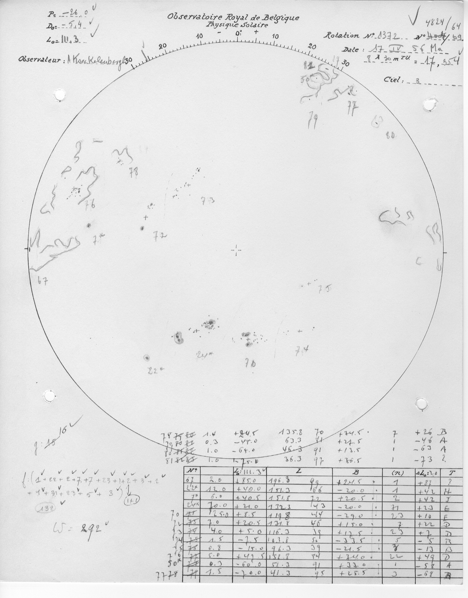
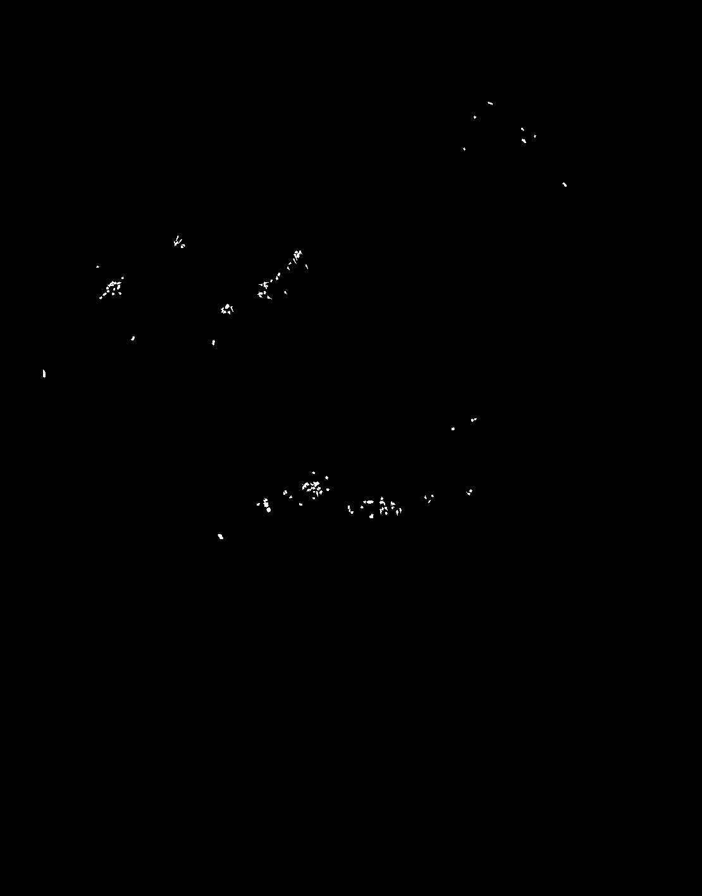
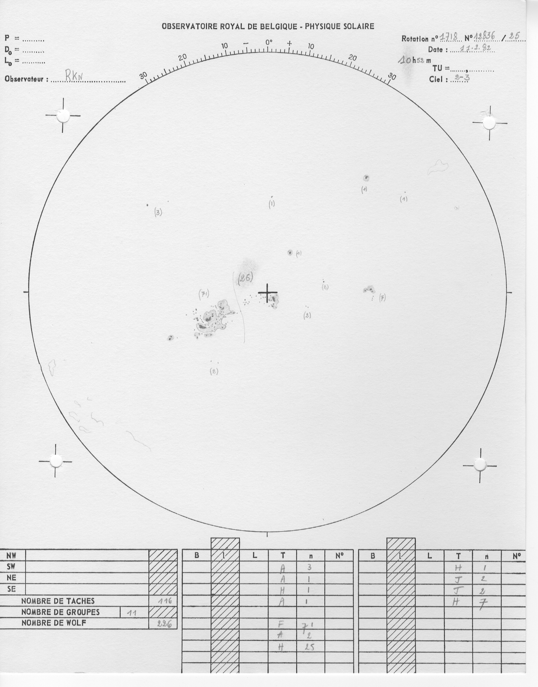
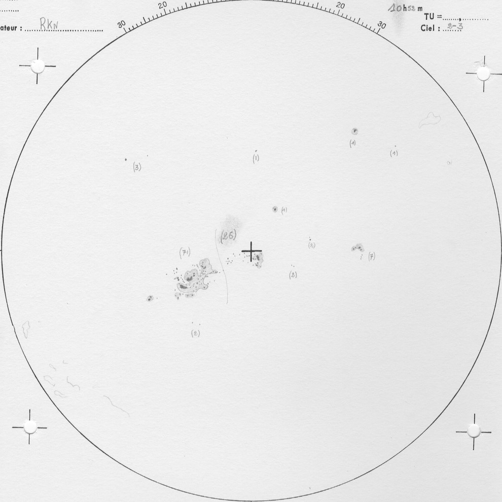
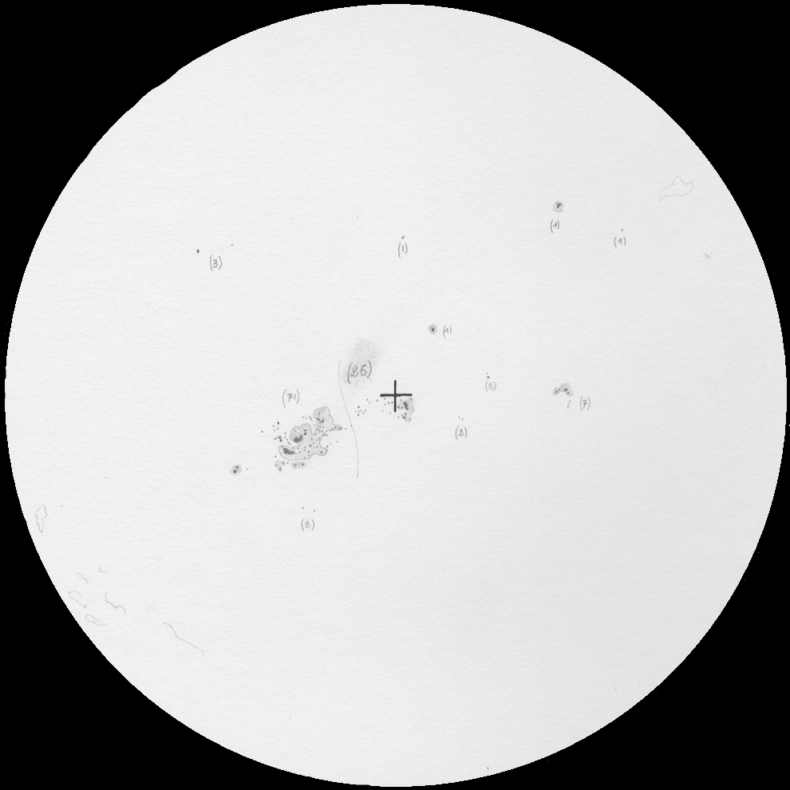
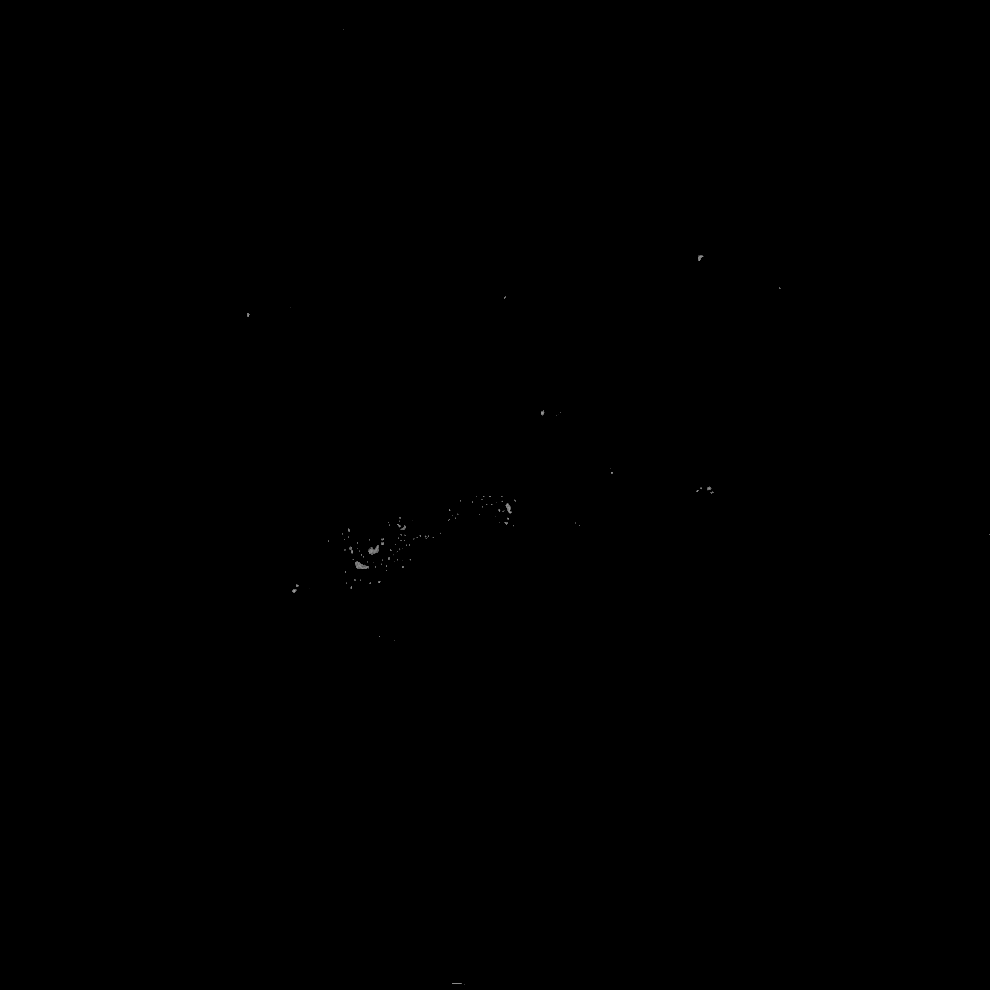
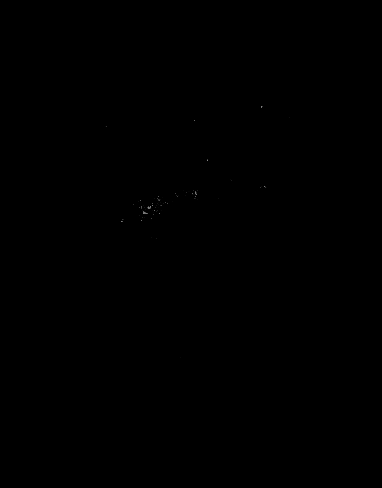

# Sunspot Detection Dashboard


**Author:** Vandegaer Geoffrey

**For:** [Royal Observatory of Belgium](https://www.astro.oma.be/en/)


## 1. Overview

The **Sunspot Detection Dashboard** provides a framework for managing labeled datasets in COCO format to train a customized U-Net model for sunspot detection. It supports the following functionalities:

1. Upload labeled images for training a tailored U-Net model.
2. Upload images to perform inferences using a U-Net pre-trained model.
3. Visualize segmentation results and track training progress interactively.

---

## 2. Table of Contents

1. [Overview](#1-overview)
2. [Table of Contents](#2-table-of-contents)
3. [Installation](#3-installation)
4. [File Structure](#4-file-structure)
5. [Usage](#5-usage)
   - [5.1 Dashboard Overview](#51-dashboard-overview)
   - [5.2 Steps to Use](#52-steps-to-use)
   - [5.3 Architecture](#53-architecture)
   - [5.4 Inputs](#54-inputs)
   - [5.5 Outputs](#55-outputs)
   - [5.6 Image Pipeline](#56-image-pipeline)
6. [License](#6-license)
7. [Note](#7-note)

---

## 3. Installation

Before the first use, run the `install.py` script. This script ensures that all necessary packages are installed, verifies the file structure, and confirms the presence of required scripts.

---

## 4. File Structure

The intended project directory is structured as follows:

```bash
project_dir/                          # Root directory
├── train_cnn.py                      # Script for training the model
├── convert_annotations.py            # Converts annotations to masks
├── run_inference.py                  # Performs inference using the trained model
├── dashboard.py                      # Launches the interactive dashboard
├── install.py                        # Installation script
├── detect_labeled_images.py          # (Optional) Filters labeled images
├── dataset/                          # Dataset directory
│   ├── images/                       # Input images
│   ├── annotations/                  # COCO JSON annotation file
│   └── masks/                        # Pixel masks generated from annotations
├── output/                           # Output directory
│   ├── trained_models/               # Saved models
│   ├── logs/                         # Logs for training
│   ├── training_plots/               # Training loss and accuracy plots
│   └── inference_results/            # Results from inference
├── images_to_run/                    # Images for inference
└── segmented_dataset/                # Segmentation results
```


Key Notes:

- The **dataset** folder contains `images`, `annotations`, and `masks`. 
  - Annotations must be in COCO format, named `instances_default.json`.
  - Masks are generated from polygon labels in the JSON file using `convert_annotations.py`.
- The **output** folder stores trained models, logs, training plots, and inference results.

---

## 5. Usage

### 5.1. Dashboard Overview

The dashboard consists of three pages:

1. **Dataset Page**
   - Upload labeled images and COCO annotation files for training.
   - Upload images for inference using a trained model.

2. **Train Page**
   - Configure training parameters, including:
     - Model name
     - Number of epochs
     - Batch size
     - Learning rate
     - Tiled image size
     - Class 1 penalty weight (false negatives for sunspots)
   - View real-time training progress and logs:
     - Selected parameters
     - Training/validation loss per epoch
     - Training completion status
   - Visualize training and validation loss plots.

3. **Inference Page**
   - Select a trained model for inference.
   - Run inferences on uploaded images.
   - Compare original images with segmentation results and masks.


### 5.2. Steps to Use

1. **Upload Dataset**: 
   - On the **Dataset Page**, upload labeled images and a COCO annotation file (`instances_default.json`). Ensure all files adhere to the specified format.
   - To perform inference, upload images in the "Dataset for Inference" section.

2. **Optional Filtering**:
   - If your dataset contains unlabeled images, use `detect_labeled_images.py` to filter them. Labeled images and annotations will be saved in the segmented file. Manually update the `dataset/images` and `dataset/annotations` folders accordingly.

3. **Train the Model**:
   - Navigate to the **Train Page**.
   - Configure training parameters and start training.

4. **Perform Inference**:
   - After training is complete, go to the **Inference Page**.
   - Select the trained model, run inference, and explore the segmentation results visually.

### 5.3. Architecture 

.png)

### 5.4. Inputs

##### convert_annotations.py

* **instances_default.json** : A COCO-organized JSON file containing polygon labels for features.

##### train_cnn.py

* **images** : The original input images.
* **masks** : Per-pixel segmentation masks differentiating the background and features, with the same dimensions as the original images.
* **Hyperparameters** : User-defined parameters, including `MODEL_NAME`, `EPOCHS`, `BATCH_SIZE`, `IMG_SIZE`, and `PENALTY_WEIGHT`.

##### run_inference.py

* **images** : The images to be segmented.
* **MODEL_NAME** : A user-provided parameter to select a pre-trained model for inference.

### 5.5. Outputs

##### convert_annotations.py

* **masks** : Black-and-white images that segment the background (black) and sunspot features (white).

##### train_cnn.py

- **training logs**: Detailed logs containing:
  - The model name.
  - Selected hyperparameters (`EPOCHS`, `BATCH_SIZE`, `LEARNING_RATE`, `IMG_SIZE`, and `PENALTY_WEIGHT` for Type 2 error in class 1 sunspots).
  - File paths for saving the model, logs, and training/validation loss plots.

* **model** : The trained model saved in `.pth` format.

* **training plot** : A plot of training and validation loss over epochs, saved as a `PNG` file.

##### run_inference.py

* **sunspot_table.csv** :A CSV file with four columns: image name, date, time, and the number of detected sunspots.

* **{MODEL_NAME}_features_polar_coordinates.json** : A `json` file structured as :

```json
{
  "Image_name0": [
    {"sunspot_id0": {"polar_coordinates": {...}, "original_image_pixel_coordinates": {...}}},
    {"sunspot_id1": {"polar_coordinates": {...}, "original_image_pixel_coordinates": {...}}},
    ...
  ],
  "Image_name1": [...]
}
```
* **segmented_dataset** : A directory containing:

    * Detected sunspot masks.
    * Overlaid masks on the original images, with sunspots appearing in green.

### 5.6. Image Pipeline 

##### train_cnn.py image pipeline:

| Step 1: Original Image | Step 2: Mask Original Image | Step 3: Augmented Images |
|-------------------------|-----------------------------|---------------------------|
|  |  |  |

---

Three augmented images are realized by original images. Selected augmentations : 
* rotation + salt and pepper noise (1 to 4% noise, 80 to 90% pepper).
* rotation + blur (blur limit =2).
* rotation + over/underexposure [+10%, -40%].

##### run_inference.py image pipeline:

| Step 1: Original Image | Step 2: Square Crop Original Image | Step 3: Darken Out of Circle Pixels |
|-------------------------|-----------------------------------|-------------------------------------|
|  |  |  |

| Step 4: Mask of detected sunspots | Step 5: Expand the mask |
|-----------------------------------|-------------------------|
|  |  |


---

## 6. License

**All rights reserved.**

---

## 7. Note

This dashboard is an initial version developed as a proof of concept. Future updates will focus on refining the architecture and improving functionality based on user feedback and further testing.

